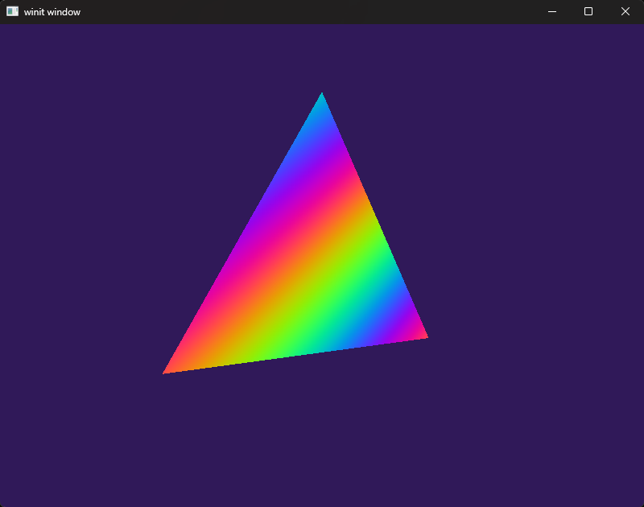

# Experiments with Rust

## Rustlings

Working through the Rustlings course

## WGPU

WGPU is an implementation of WebGPU in Rust, an explicit 'Vulkan like' API.

### Basic Triangle

# Credits

[wgpu - Cross-platform pure-rust graphics API based on WebGPU (Github)](https://github.com/gfx-rs/wgpu)

[winit - Cross-platform window creation and management in Rust (Github)](https://github.com/rust-windowing/winit)

[glam - glm like maths library for Rust](https://docs.rs/glam/latest/glam/)

[Inigo Quilez - Palettes (shadertoy)](https://www.shadertoy.com/view/ll2GD3)
